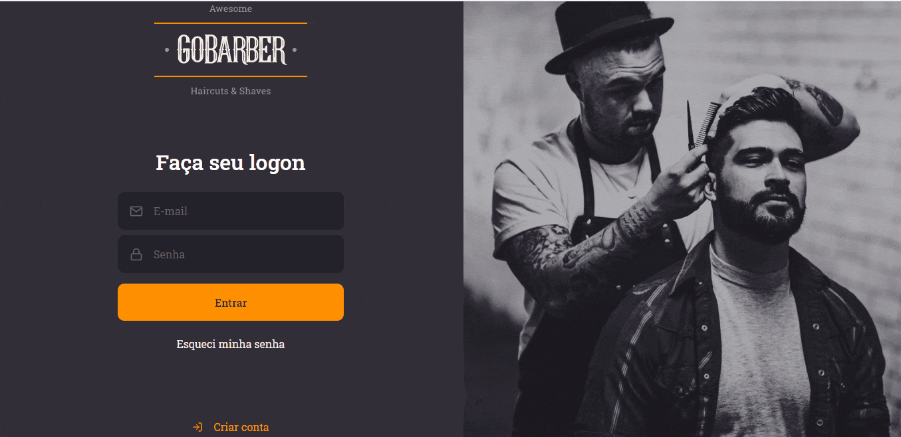

<h1 align="center">
  
</h1>

<h1>
  
</h1>

## 📝 Description

<strong>GoBarber</strong> is an app for barbershops' schedule services.

This repo aims to save the frontend of this app, in order to integrate later with the backend's API and its database.

---

## 💻 Used Technologies

This app is under construction. In the end the technologies will be listed.

---

Made with 💙 by José Renato Montagnana 👋🏻 [Get in touch!](https://www.linkedin.com/in/joserenato-devfullstack/)
